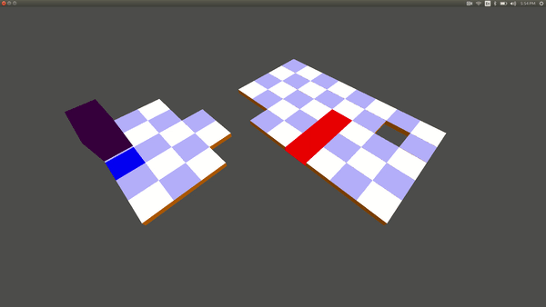

## BLOXORZ
MADE BY- HARSHIT PATNI (201501107)

### Abstract-
* A 3d game in which there is a movable cuboidal block. The goal of the player is to make it fall into a square hole 
* The world consists of square tiles which can be arranged in any manner. The tiles have to be carved out of a 10 X 10 area 
* The movable block is a cuboid made of 2 cubes stacked on top of each other
* The Player wins the game when the block falls through the square hole
  ** The block has to be vertical for it to fall through the hole)
* If the block falls down the edges then the game ends. 
* The tiles are of 4 types - 
 ** normal tiles
 ** fragile tiles
 ** bridges
 ** switches
* In order for a bridge to be constructed, a switch (in a different location) needs to be pressed by the movable block 
* It is not necessary to remain on the switch to keep the bridge in its current state
* The next kind of tiles - fragile tiles
  ** They are marked using different colours
  ** If the block stands up vertically, then the tile breaks
  ** To move on fragile tiles, the block should lie horizontally (on the longer side).

### Gameplay

* (The quality of the gif had to be reduced to reduce its size)

### Controls

* UP-DOWN-LEFT-RIGHT keys to move
* 'T' to toggle top view
* 'Y' to toggle helicopter view
* 'R' to toggle tower view
* 'U' to toggle follower view
* 'H' to toggle adjustment in follower view
* 'I' to toggle first person view
* Left mouse click and drag, right mouse click and drag to control view in helicopter
* Mouse movement in first person view to change look direction

